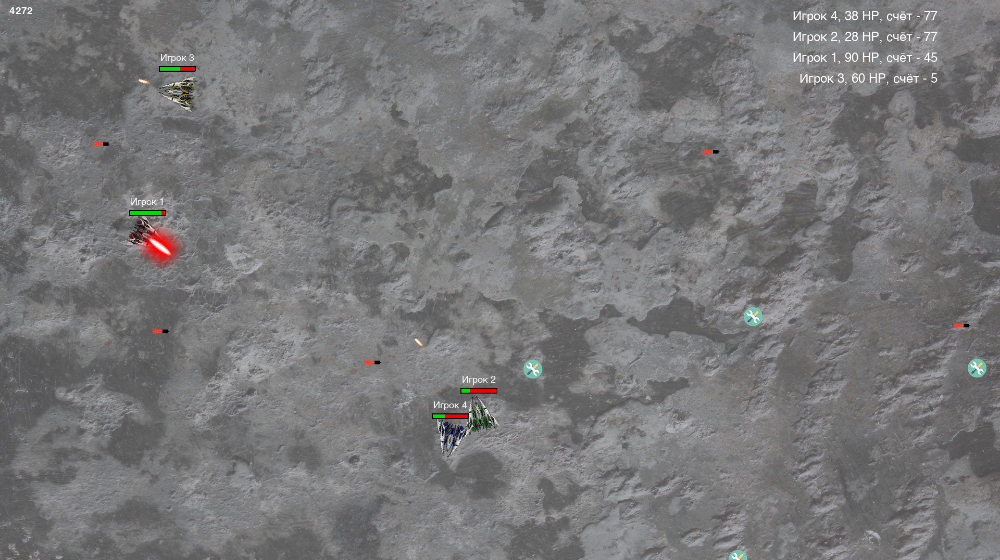
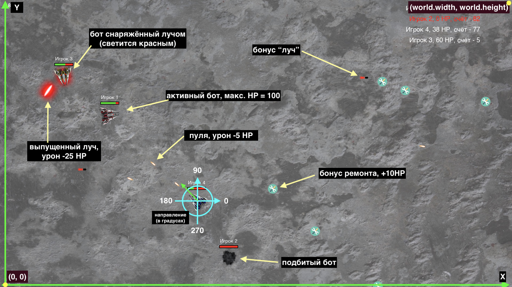

# Code game challenge README

## Инструкция по запуску

1. Скачать и установить Python 3.9+ https://www.python.org/downloads/
2. Если используется Windows, то после установки установить пути к Python в переменную `PATH`, например по такой инструкции https://okdk.ru/kak-dobavit-python-v-peremennuju-windows-path/
3. Скачать проект `codegame.zip` и распаковать в отдельную папку
4. Открыть терминал (консоль) и перейти в эту папку командой `cd ваш_путь`
5. Установить зависимости для проекта - библиотеку `PyGame` - командой `pip install pygame`
6. Установка займёт некоторое время
7. После установки можно запускать симуляцю боя `python main.py`

## Игровое поле

Внешний вид:

Что есть что:

## Правила матча
1. Матч длится 60 секунд
2. Принимают участие 3 или 4 участника-бота
3. Побеждает тот участник, которого не подбили и у которого больше всего очков на момент окончания матча
4. Если по окончании матча подбиты все участники (очень редкая ситуация), то побеждает тот, у кого больше очков.

### Механика игры

#### Движение в пространстве

1. Движение ботов осуществляется по игровому полю путём, грубо говоря, "нажатий на педаль газа". Одно нажатие даёт импульс движения.
1. Между нажатиями на газ есть некоторый интервал, т.е. не получится разогнаться до запредельных скоростей.
1. Если не нажимать газ, то движение плавно замедлится до нуля из-за силы трения с поверхностью.
1. Для поворота есть 2 действия - поворот влево и вправо. Вызов одного из этих действий осуществляет поворот бота на небольшой угол.
1. Игровое поле - закрытое пространство - выехать за его пределы не получится.
1. При столкновении с другим ботом происходит отскакивание обеих ботов.

#### Бой

1. На старте у всех ботов по 100 очков здоровья (HP).
1. В процессе матча происходит бой между ботами, у каждого бота есть вооружение для стрельбы по соперникам.
1. Очки начисляются боту, успешно попавшему по сопернику.
2. Начисленные очки равны количеству урона, нанесенного попаданием.
1. Виды вооружений:
    1. Встроенная пушка, стреляет пулями, урон пули `-5 HP`. Имеется у всех ботов, боезапас неограничен, но есть некоторый интервал между выстрелами
    1. Орудие "Луч", урон `-25 HP`. Имеется у ботов, которые подняли бонус "заряд луча". 1 бонус = 1 выстрел, сам выпущенный луч летит медленнее, чем пуля
Когда HP снижается до нуля, то происходит взрыв бота и его выбывание из матча. Такой бот считается подбитым.
1. Подбитые боты не влияют на оставшихся участников, игнорируются физическим движком.

#### Бонусы
1. Виды бонусов:
    1. Бонус ремонта - при его поднятии происходит увеличение HP на 10, однако свыше 100 увеличиться не может.
    1. Бонус "заряд луча" - его поднятие даёт боту возможность единомоментно выстрелить лучом по сопернику и нанести ему урон `-25 HP` при успешном попадании.
2. Бонусы появляются на поле случайным образом

## Где документация

Документация по публичным методам игровых объектов и их структура представлена в файлах внутри папки `interfaces/`

* `interfaces/GameObject` - игровой объект с координатами, направлением и скоростью
* `interfaces/Bonus` - опсание бонуса
* `interfaces/Projectile` - описание снаряда (обычного или луча)
* `interfaces/NPC` - объект другого игрока на арене
* `interfaces/IPlayer` - интерфейс игрока

## Рекомендации по разработке стратегий

* Весь код стратегии пишется внутри метода `update` в файле `MyBot.py`
* Подключить и попробовать свою стратегию можно в файле `main.py`. Там можно запускать матчи между своими ботами, а также с уже имеющимися "пресетными" ботами из пакета `bots/`
* Не стоит делать сложный по производительности код внутри метода `update` - это будет тормозить весь движок (никаких длинных вложеных циклов, выделений огромных массивов и т.д)
* Методов, предоставляемых интерфейсами `IPlayer` и остальными в папке `interfaces` вполне достаточно для разработки любой стратегии - используйте их по творчески!
* Не допускается код, который совершает операции ввода/вывода, запуск сторонних процессов, работу с сетью - стратегии с таким кодов не будут допущены к соревнованию!
* Можно использовать **ВСТРОЕННЫЕ** функции Python для математики (`math`), рандомизации (`random`) и других вычислений
* Примеры простых стратегий можно найти в папке `bots`. По ним можно понять принцип написания
* Если ваш бот в процессе матча самопроизвольно взрывается (не из-за игровой механики), то это значит, что в коде вашего бота произошла ошибка исполнения - нужны отладка и исправление.
* Можно выставить комфортное разрешение экрана в конфиге `screen_resolution.py`